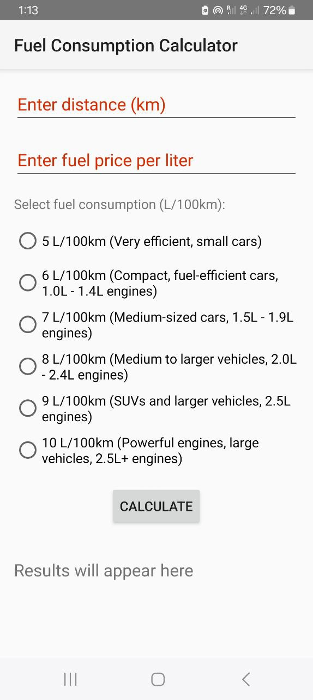

# Car Fuel Consumption Calculator 🚗⛽

This is an Android application built in Android Studio with **Java** code. That helps users calculate the total fuel cost for a trip based on distance, fuel price, and engine consumption rate.

## 📱 Description

The **Car Fuel Consumption Calculator** allows users to:

- Enter the **travel distance in kilometers (km)**
- Input the **fuel price per liter**
- Select the **engine's fuel consumption rate**

The app then calculates the **estimated total cost** of fuel for the trip.

## ⚙️ Engine Consumption Options

Users can select from predefined fuel consumption values:

| Consumption | Description                     |
|-------------|---------------------------------|
| 5L/100km    | Small cars, very efficient      |
| 6L/100km    | Compact cars                    |
| 7L/100km    | Mid-size sedans                 |
| 8L/100km    | Crossovers or older vehicles    |
| 9L/100km    | SUVs or less efficient engines  |
| 10L/100km   | Large vehicles, vans, trucks    |

## 🚀 Features

- Simple and clean UI
- Real-time cost calculation
- Useful for trip planning and budgeting

## 📷 Screenshots



## 📦 Technologies Used

- Java
- Android SDK
- XML (for UI layout)

## 📲 How to Install

1. Clone the repository:
   ```bash
   https://github.com/ds-alt/Car-Fuel-Consumption-Calculator.git
